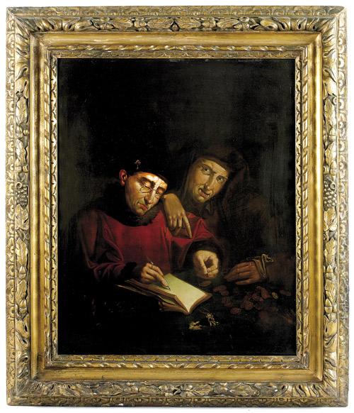
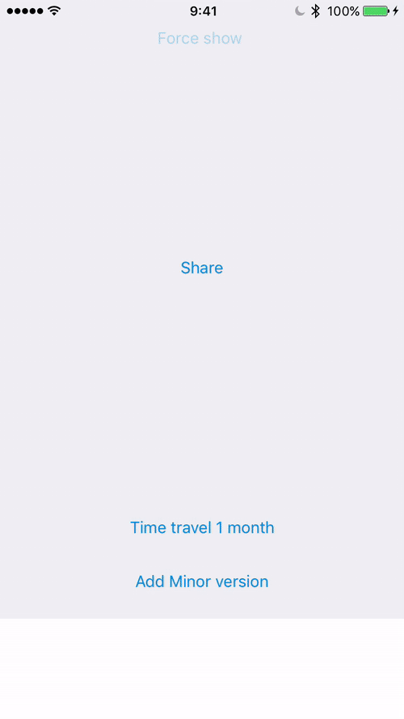

⚠️ Use the [native ratings UI](https://developer.apple.com/app-store/ratings-and-reviews/), nowadays it is against the app store rules to present a custom UI before the native one⚠️

# Prompt Rating

If you are a bit baroque, you will love this.

[](https://youtu.be/JBYg4fG7FQM)

We used this framework at Infojobs, to ask for an AppStore rating in very specific moments, and then, given the user's interaction, we update when the prompt rating will be shown again in a very baroque way.

You define rules, rules have conditions, when all the conditions are fulfilled, a prompt rating is shown, depending on the user feedback, the conditions for the given rule change.

Simple, right? 🙃

## Usage

Define the events that are relevant to your prompt rating:

```
enum PromptRatingEvent: String, PromptEvent {

    case ShareOffer = "ShareOffer"
    case Application = "Application"

    func value() -> String {
        return rawValue
    }
}
```

Define the rules and conditions to trigger the prompt rating:

```
let aplicationRule = PromptRule(
  forEvent: PromptRatingEvent.Application
).showForTheFirstTimeAfter(
    (5, DefaultEvents.Session), (7, PromptRatingEvent.Application)
).whenPromptRatingIs(
    (.Positive, .Positive),
    showAfter:
    (4, DefaultEvents.Month)
).whenPromptRatingIs(
    (.Positive, .Negative),
    showAfter:
    (1, DefaultEvents.MinorVersionIncreased)
).whenPromptRatingIs(
    (.Negative, .Positive),
    showAfter:
    (1, DefaultEvents.MinorVersionIncreased)
).whenPromptRatingIs(
    (.Negative, .Negative),
    showAfter:
    (1, DefaultEvents.MinorVersionIncreased)
)

```

Use the default event trackers:

```
let minorVersionTracker = MinorVersionEventTracker(
    storage: getUserDefaults(),
    appInfo: ApplicationVersion()
)
let sessionTracker = SessionEventTracker(
    storage: getUserDefaults()
)
let monthTracker = MonthEventTracker(
    storage: getUserDefaults()
)
```

Or define your own implementing the 'PromptGlobalEventTracker' protocol:

```

class SomethingReleventForYouTracker: PromptGlobalEventTracker {

    func evaluateOnApplicationLaunched() -> [PromptEvent] {
      //Return your events here
    }
    func evaluateOnApplicationClosed() -> [PromptEvent] {
      //Return your events here
    }
}

```

Define where to store the state of the rules:

```
let rulesStore = UserDefaultsPromptRatingDataStore(
  userDefaults: UserDefaults.standard
)
```

Setup a prompt rating instance with the previously declared trackers, store and rules:

```
let promptRating = PromptRating(rulesStore: rulesStore)

promptRating.setRules([aplicationRule])
promptRating.setEventTrackers([minorVersionTracker, sessionTracker, monthTracker])

```

Wherever you need to track that an event happened out of the automagical 'PromptGlobalEventTracker' objects, add an event to your PromptRating instance:

```
yourPromptRatingSharedInstance.addEvent(PromptRatingEvent.Application)
```
If the event you are about to track, can trigger the prompt rating:
```
yourPromptRatingSharedInstance.addEvent(PromptRatingEvent.Application) { rule, completionHandler in

}
```
And report the result of the prompt rating with the convenient completion handler.

To better understand all this pile of baroque work, read the tests and play with the example app.
## Provided UI

If you are not working at Infojobs, this section will not be useful for you 🙂



Watch the example app to see how you can configure this screen.

## Final thoughts

This library was concieved before the native UI for prompt ratings was released, nowadays it is against the app store rules to present a custom UI before the native rating UI
[](https://developer.apple.com/app-store/ratings-and-reviews/)
